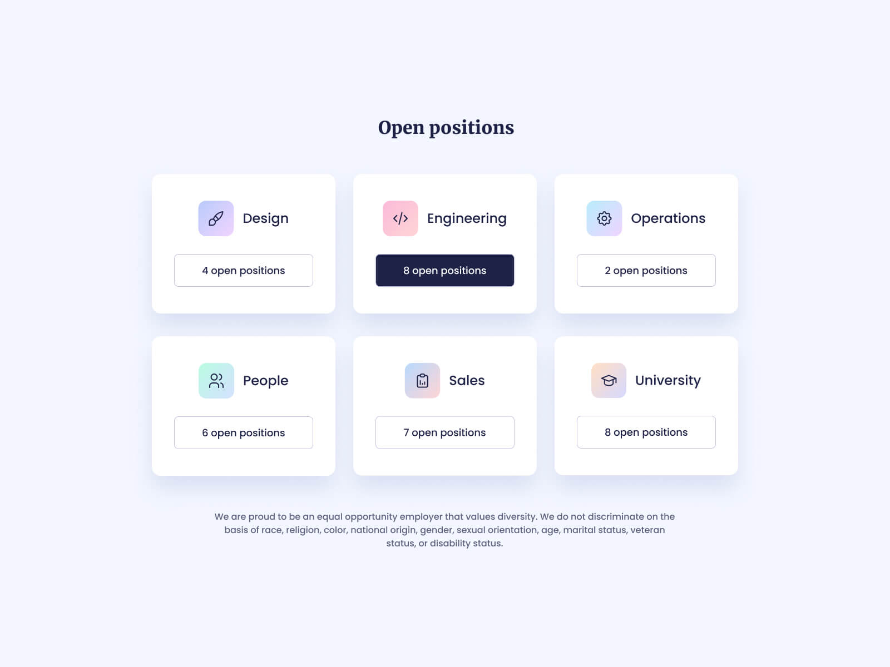
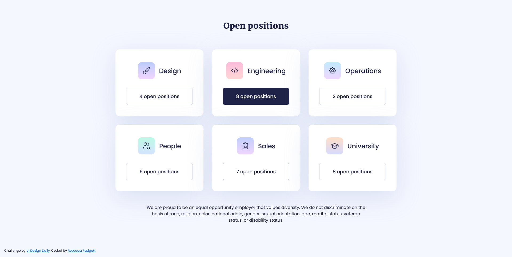

# Job Cards UI Component - React.js

This is a **Job Card UI component** built with **React.js** and **CSS**, inspired by a design from [UI Design Daily](https://www.uidesigndaily.com/). It showcases a job-related icon with a linear gradient background and a button displaying the number of open positions.

## Design



## Screenshot 


## Demo

- View the live demo on [GitHub Pages](https://bccpadge.github.io/job-cards/) 

## Features

- **Job Icon**: Customizable icon with a linear gradient background representing the job category.
- **Open Positions Button**: Displays the number of available job positions.
- **Responsive Design**: Fully responsive and ready for integration into job boards or career pages.

## Setup

This project uses **Vite** for fast React development and features hot module replacement (HMR). It comes with essential configurations, including ESLint rules for code quality.

### Installation

1. Clone the repository:

```bash
   git clone https://github.com/yourusername/job-cards.git
```

2. Install dependencies:

```bash
   cd job-cards
   npm install
```

3. Run the development server:

```bash
   npm run dev
```

## React + Vite

This project is set up with **Vite**, offering a minimal and fast development environment for React:

- **@vitejs/plugin-react**: Uses Babel for Fast Refresh.
- **@vitejs/plugin-react-swc**: Uses SWC for Fast Refresh.

For more information, check out the official Vite React plugins:
- [Vite React Plugin (Babel)](https://github.com/vitejs/vite-plugin-react/blob/main/packages/plugin-react/README.md)
- [Vite React Plugin (SWC)](https://github.com/vitejs/vite-plugin-react-swc)

